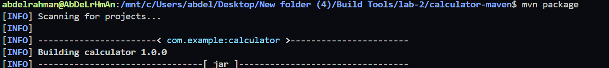
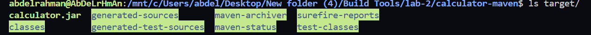
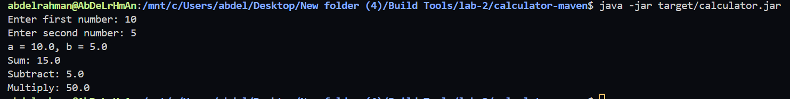

# Lab 2 - Building and Packaging Java Application with Maven

## 📌 Objective

This lab demonstrates how to build, test, package, and run a Java application using **Apache Maven**.

---

## 🛠 Prerequisites

Before starting this lab, ensure the following are installed:

- Ubuntu 22.04 (or later)
- Java JDK 17
- Git
- Apache Maven
- Internet Connection

---

## 📂 Project Repository

Repository used in this lab:

```text
https://github.com/Ibrahim-Adel15/calculator-maven.git
```

---

# Step 1 - Install Maven

Apache Maven is a build automation and dependency management tool for Java projects.

### Install Maven

```bash
sudo apt update
sudo apt install maven -y
```

### Verify Installation

```bash
mvn -version
```

The command should display the installed Maven version along with the Java version.

---

# Step 2 - Clone the Project Repository

Clone the project from GitHub and navigate to the project directory.

### Clone Repository

```bash
git clone https://github.com/Ibrahim-Adel15/calculator-maven.git
```

### Navigate to the Project

```bash
cd calculator-maven
```

### Verify Project Files

```bash
ls
```

Expected files:

- `pom.xml`
- `src/`

The presence of the `pom.xml` file confirms that this is a Maven project.

---

# Step 3 - Run Unit Tests

Run the project's unit tests to verify that the application functions correctly.

### Command

```bash
mvn test
```

### Expected Result

```text
BUILD SUCCESS
```

This confirms that all unit tests passed successfully.

### Screenshot


---

# Step 4 - Build the Application

Build and package the application into an executable JAR file.

### Command

```bash
mvn clean package
```

### Expected Result

```text
BUILD SUCCESS
```

The `clean` goal removes previous build files, while `package` compiles the source code, executes tests, and generates the JAR file.

### Screenshot



---

# Step 5 - Verify the Generated Artifact

After a successful build, verify that the JAR file has been created inside the `target` directory.

### Command

```bash
ls target/
```

### Expected Output

```text
calculator.jar
```

> **Note:** Depending on the project configuration, the generated file may have a version in its name (for example, `calculator-1.0-SNAPSHOT.jar`).

### Screenshot



---

# Step 6 - Run the Application

Run the generated JAR file.

### Command

```bash
java -jar target/calculator.jar
```

> If your generated JAR has a different name, replace `calculator.jar` with the actual filename.

### Expected Result

The application should start successfully without any errors.

### Screenshot



---

# ✅ Conclusion

In this lab, the Java application was successfully:

- Installed Apache Maven.
- Cloned from the GitHub repository.
- Tested using Maven Unit Tests.
- Built successfully.
- Packaged into a JAR file.
- Executed successfully.

This demonstrates the complete Maven build lifecycle from source code to a runnable Java application.

---

# 📁 Project Structure

```text
calculator-maven/
│
├── pom.xml
├── src/
├── target/
│   └── calculator.jar
└── README.md
```

---

# 👨‍💻 Author

**Abdelrahman Tarek Ahmed Elsayed**

Cloud & DevOps Engineer