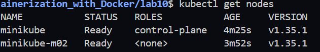
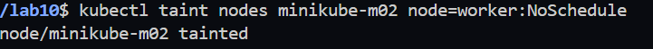

# Lab 10: Node Isolation Using Taints in Kubernetes

## Objective

Isolate a worker node using Kubernetes **Taints** with the `NoSchedule` effect.

---

## Prerequisites

- Kubernetes Cluster
- kubectl
- Minikube (2 Nodes)

---

## Step 1: Verify the Cluster Nodes

```bash
kubectl get nodes
```

**Screenshot**



---

## Step 2: Display Node Information

```bash
kubectl get nodes -o wide
```

---

## Step 3: Apply a Taint to the Worker Node

```bash
kubectl taint nodes minikube-m02 node=worker:NoSchedule
```

**Screenshot**



---

## Step 4: Verify the Taint

```bash
kubectl describe node minikube-m02
```

Expected Output

```
Taints:
node=worker:NoSchedule
```

**Screenshot**


---

## Step 5: Describe All Nodes

```bash
kubectl describe nodes
```

---

## Step 6: Remove the Taint (Optional)

```bash
kubectl taint nodes minikube-m02 node=worker:NoSchedule-
```

## Result

Successfully isolated the worker node using a Kubernetes taint with the **NoSchedule** effect.
