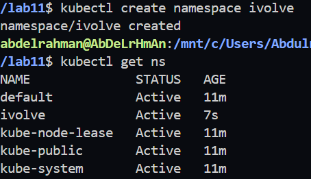
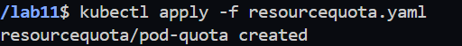
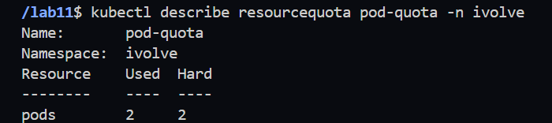
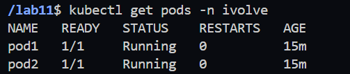
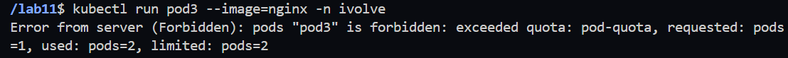

# Lab 11: Namespace Management and Resource Quota Enforcement

## Objective

Create a Kubernetes namespace and enforce a **ResourceQuota** that limits the namespace to a maximum of **2 Pods**.

---

## Prerequisites

- Kubernetes Cluster
- kubectl installed and configured

---

## Step 1: Create the Namespace

Create a new namespace named **ivolve**.

```bash
kubectl create namespace ivolve
```

Verify that the namespace has been created successfully.

```bash
kubectl get namespaces
```

**Screenshot**



---

## Step 2: Create the ResourceQuota Configuration

Create a file named **resourcequota.yaml**.

```yaml
apiVersion: v1
kind: ResourceQuota
metadata:
  name: pod-quota
  namespace: ivolve
spec:
  hard:
    pods: "2"
```

---

## Step 3: Apply the ResourceQuota

Apply the ResourceQuota configuration to the namespace.

```bash
kubectl apply -f resourcequota.yaml
```

Expected Output

```text
resourcequota/pod-quota created
```

**Screenshot**



---

## Step 4: Verify the ResourceQuota

Display the ResourceQuota details.

```bash
kubectl describe resourcequota pod-quota -n ivolve
```

Example Output

```text
Name:        pod-quota

Resource     Used   Hard
pods         0      2
```

**Screenshot**



---

## Step 5: Create Two Pods

Create two Pods inside the **ivolve** namespace.

```bash
kubectl run pod1 --image=nginx -n ivolve

kubectl run pod2 --image=nginx -n ivolve
```

Verify that both Pods are running.

```bash
kubectl get pods -n ivolve
```

**Screenshot**



---

## Step 6: Attempt to Create a Third Pod

Try creating a third Pod.

```bash
kubectl run pod3 --image=nginx -n ivolve
```

Expected Output

```text
Error from server (Forbidden):
pods "pod3" is forbidden:
exceeded quota: pod-quota,
requested: pods=1,
used: pods=2,
limited: pods=2
```

**Screenshot**



---

## Verification Commands

```bash
kubectl get namespaces

kubectl get resourcequota -n ivolve

kubectl describe resourcequota pod-quota -n ivolve

kubectl get pods -n ivolve
```

---

## Files

### resourcequota.yaml

```yaml
apiVersion: v1
kind: ResourceQuota
metadata:
  name: pod-quota
  namespace: ivolve
spec:
  hard:
    pods: "2"
```

---

## Result

- Created a Kubernetes namespace named **ivolve**.
- Applied a **ResourceQuota** to limit the namespace to **2 Pods**.
- Verified that Kubernetes prevents creating additional Pods once the quota is reached.