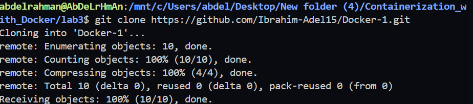
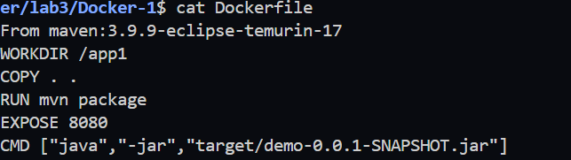
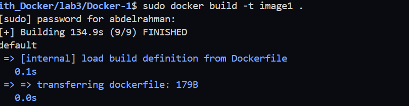
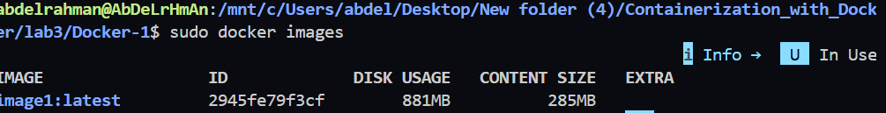
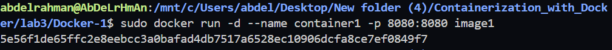
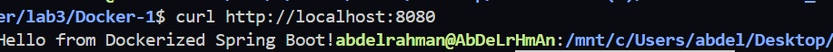
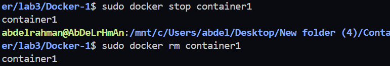

# Lab 3: Run Java Spring Boot App in a Docker Container

## Objective

Run a Java Spring Boot application inside a Docker container using a Maven base image with Java 17.

---

# Prerequisites

- Docker
- Git

---

# Step 1: Clone the Repository

Clone the application source code.

```bash
git clone https://github.com/Ibrahim-Adel15/Docker-1.git

cd Docker-1
```

### Screenshot


---

# Step 2: Create Dockerfile

Create a file named **Dockerfile** in the project root.

### Screenshot


---

# Step 3: Build Docker Image

Build the Docker image.

```bash
docker build -t app1 .
```

### Screenshot


---

# Step 4: Check Image Size

Display the created Docker image.

```bash
docker images
```

Example Output:

```
REPOSITORY   TAG      IMAGE ID      SIZE
app1         latest   xxxxxxxxx     1.2GB
```

### Screenshot


---

# Step 5: Run Docker Container

Run the application container.

### Screenshot


---

# Step 6: Test the Application

Open your browser and navigate to:

```
http://localhost:8080
```

or test using curl:

```bash
curl http://localhost:8080
```

### Screenshot


---

# Step 7: Stop & Remove the Container

```bash
docker stop container1
docker rm container1
```

### Screenshot


---

# Project Structure

```
Docker-1/
│
├── Dockerfile
├── pom.xml
├── src/
├── target/
└── README.md
```

---

# Docker Commands Summary

```bash
git clone https://github.com/Ibrahim-Adel15/Docker-1.git

cd Docker-1

docker build -t app1 .

docker images

docker run -d --name container1 -p 8080:8080 app1

docker ps

docker logs container1

docker stop container1

docker rm container1
```

---

# Technologies Used

- Java 17
- Spring Boot
- Maven
- Docker

---

# Author

**Abdelrhman Tarek Ahmed**

Faculty of Computers and Artificial Intelligence

Cloud & DevOps Engineer
