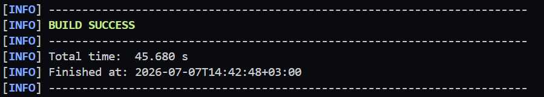
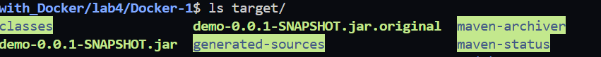
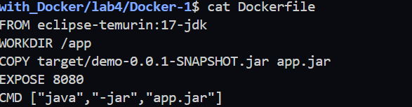
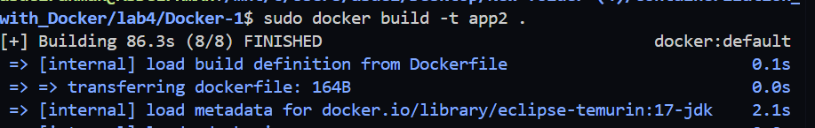
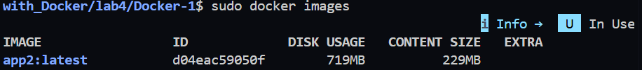
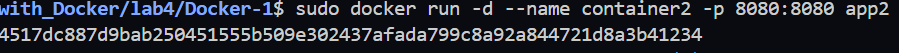
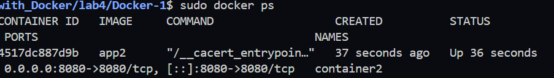
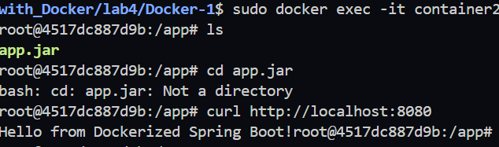
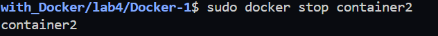

# Lab 4: Run Java Spring Boot App in a Docker Container

## Objective

Run a Java Spring Boot application inside a Docker container using a **Java 17 base image** after building the application locally with Maven.

---

# Repository

Clone the project from:

https://github.com/Ibrahim-Adel15/Docker-1.git

---

# Prerequisites

- Docker
- Git
- Java 17
- Maven
- Ubuntu

---

# Step 1: Clone the Repository

Clone the application source code.

```bash
git clone https://github.com/Ibrahim-Adel15/Docker-1.git

cd Docker-1
```

---

# Step 2: Build the Application

Build the project using Maven.

```bash
mvn clean package
```

This command generates the JAR file inside the `target` directory.

### Screenshot



---

# Step 3: Verify Generated JAR

Verify that the JAR file has been created.

Linux/macOS:

```bash
ls target
```

Expected file:

```
demo-0.0.1-SNAPSHOT.jar
```

### Screenshot



---

# Step 4: Create Dockerfile

Create a file named `Dockerfile` in the project root.


### Screenshot



---

# Step 5: Build Docker Image

Build the Docker image.

```bash
docker build -t app2 .
```

### Screenshot



---

# Step 6: Check Docker Image Size

Display the Docker images.

```bash
docker images
```

Example:

```
REPOSITORY   TAG      IMAGE ID      SIZE
app2         latest   xxxxxxxxx     420MB
```

### Screenshot



---

# Step 7: Run the Container

Run a container from the image.

```bash
docker run -d --name container2 -p 8080:8080 app2
```

### Screenshot



---

# Step 8: Verify Running Container

Check that the container is running.

```bash
docker ps
```

### Screenshot



---

# Step 9: Test the Application

Open your browser and navigate to:

```
http://localhost:8080
```

or

```bash
curl http://localhost:8080
```

### Screenshot



---

# Step 10: Stop the Container

Stop the running container.

```bash
docker stop container2
```

### Screenshot



---

# Step 11: Verify Stopped Container

Display all containers.

```bash
docker ps -a
```

The container status should be:

```
Exited
```
---

# Step 12: Remove the Container

Delete the stopped container.

```bash
docker rm container2
```

---

# Step 13: Verify Container Removal

Run:

```bash
docker ps -a
```

The container should no longer appear.

---


# Project Structure

```
Docker-1/
│
├── Dockerfile
├── pom.xml
├── src/
├── target/
│   └── demo-0.0.1-SNAPSHOT.jar
├── README.md
└── images/
```

---

# Commands Summary

```bash
git clone https://github.com/Ibrahim-Adel15/Docker-1.git

cd Docker-1

mvn clean package

docker build -t app2 .

docker images

docker run -d --name container2 -p 8080:8080 app2

docker ps

docker stop container2

docker ps -a

docker rm container2

docker ps -a
```

---

# Technologies Used

- Java 17
- Spring Boot
- Maven
- Docker

---

# Author

**Abdelrhman Nssar**

Faculty of Computers and Artificial Intelligence

Cloud & DevOps Engineer