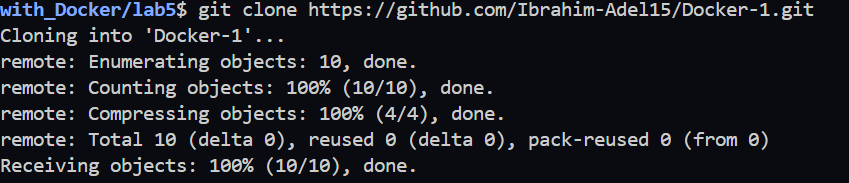
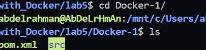
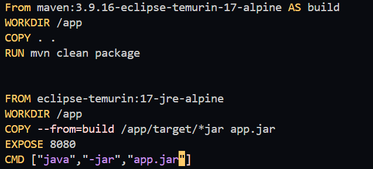
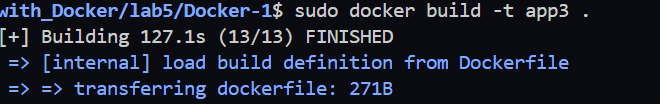
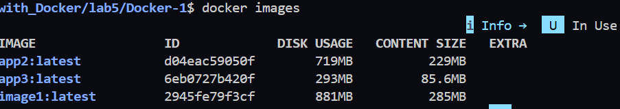
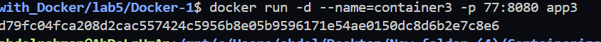
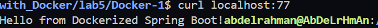
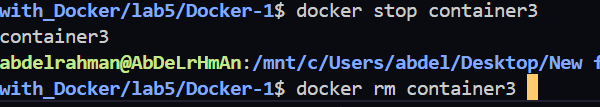

# Lab 5: Multi-Stage Docker Build

## Objective

Build a Java application using a **Multi-Stage Docker Build** to create a smaller and more efficient Docker image.

---

# Step 1: Clone the Repository

Clone the application source code from GitHub.

```bash
git clone https://github.com/Ibrahim-Adel15/Docker-1.git
```

Move to the project directory.

```bash
cd Docker-1
```

### Screenshot


---

# Step 2: Verify the Project Structure

Check that the project contains the required files.

```bash
ls
```

or on Windows PowerShell:

```powershell
dir
```

Expected files:

* `pom.xml`
* `src/`

### Screenshot


---

# Step 3: Create the Dockerfile

Create a file named **Dockerfile** and add the following content.


### Screenshot


---

# Step 4: Build the Docker Image

Build the Docker image and name it **app3**.

```bash
docker build -t app3 .
```

Wait until the build finishes successfully.

### Screenshot


---

# Step 5: Verify the Docker Image

Display all Docker images.

```bash
docker images
```

Verify that the **app3** image exists and note its size.

### Screenshot


---

# Step 6: Run the Docker Container

Run a container named **container3**.

```bash
docker run -d --name container3 -p 77:8080 app3
```

### Screenshot


---

# Step 7: Verify the Running Container

Check that the container is running.

```bash
docker ps
```

### Screenshot


---

# Step 8: Test the Application

Open your browser and navigate to:

```
http://localhost:8080
```

Or test using curl.

```bash
curl http://localhost:8080
```

The application should respond successfully.

### Screenshot


---


# Step 9: Stop & Remove the Container

Stop & Remove the running container.

```bash
docker stop container3
docker rm container3
```

### Screenshot


---


# Conclusion

In this lab, we successfully:

* Cloned the Java application repository.
* Created a Multi-Stage Dockerfile.
* Built the application using Maven.
* Created a lightweight runtime image using Java JRE.
* Ran the application inside a Docker container.
* Tested the application on port **77**.
* Stopped and removed the container.
