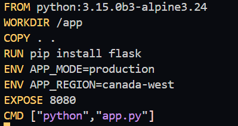
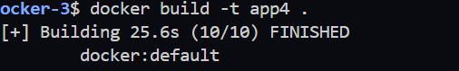
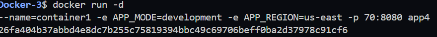
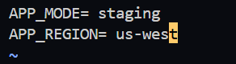
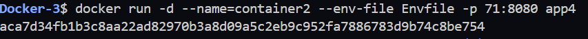
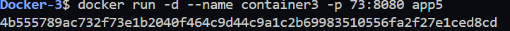

# Lab 6: Managing Docker Environment Variables Across Build and Runtime

## Objective

Learn how to manage Docker environment variables using three different methods:

* Passing variables using the `docker run` command.
* Loading variables from an environment file.
* Defining variables inside the Dockerfile.

---

# Step 1: Clone the Repository

Clone the application source code.

```bash
git clone https://github.com/Ibrahim-Adel15/Docker-3.git
```

Navigate to the project directory.

```bash
cd Docker-3
```


# Step 2: Verify the Project Files

List the project files.

```bash
ls
```


Expected files include:

* `app.py`

# Step 3: Create the Dockerfile

Create a file named **Dockerfile** and add the following content.


### Screenshot



---

# Step 4: Build the Docker Image

Build the Docker image and name it **app4**.

```bash
docker build -t app4 .
```

### Screenshot



---

# Step 5: Run Container Using Command-Line Environment Variables

Run the first container and pass the environment variables directly using the `-e` option.


### Screenshot



---

# Step 6: Run Container Using an Environment File

Create a file named **Envfile**.

```text
APP_MODE=staging
APP_REGION=us-west
```



Run the second container using the environment file.

```bash
docker run -d \
--name container2 \
-p 8082:8080 \
--env-file .env \
app4
```


### Screenshot


---

# Step 7: Run Container Using Dockerfile Environment Variables

Run the third container without specifying any environment variables.

```bash
docker run -d \
--name container3 \
-p 73:8080 \
app5
```


The application will use the default values defined in the Dockerfile:

* APP_MODE=production
* APP_REGION=canada-west

### Screenshot



---

# Step 8: Test the Application


Container 1

(screenshots/curl1.png)

Container 2

(screenshots/curl2.png)

Container 3

(screenshots/curl3.png)


# Conclusion

In this lab, we successfully:

* Cloned the application repository.
* Created a Dockerfile using the Python base image.
* Installed Flask inside the container.
* Built the Docker image successfully.
* Passed environment variables using the `docker run` command.
* Loaded environment variables from an external `.env` file.
* Used default environment variables defined in the Dockerfile.
* Tested the application using three different configurations.
* Stopped and removed the containers.
* Deleted the Docker image successfully.
