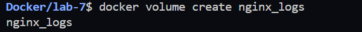
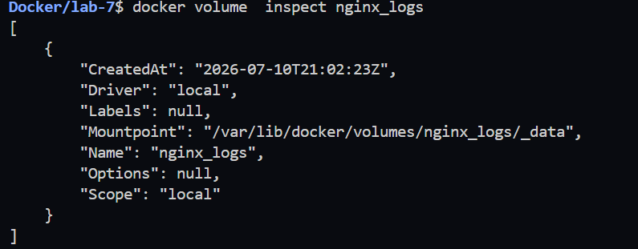
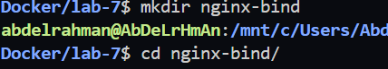
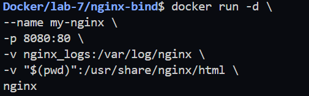
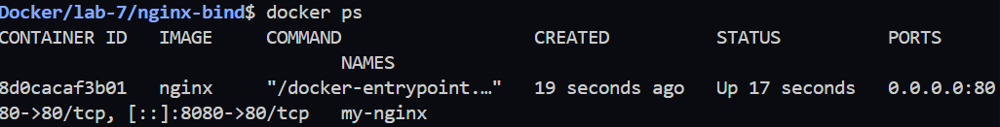
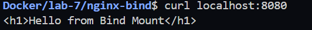
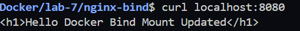
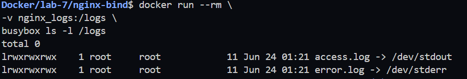
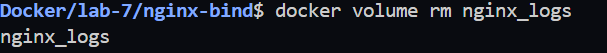

# Lab 7: Docker Volume and Bind Mount with Nginx

## Objective

This lab demonstrates how to use **Docker Volumes** and **Bind Mounts** with an Nginx container to persist logs and serve static web content from the host machine.

---

## Step 1: Create Docker Volume

List existing volumes:

```bash
docker volume ls
```

Create a new volume:

```bash
docker volume create nginx_logs
```

Verify the volume:

```bash
docker volume ls
```

### Screenshot



---

## Step 2: Verify the Volume Location

Inspect the volume:

```bash
docker volume inspect nginx_logs
```

### Screenshot



---

## Step 3: Create the Bind Mount Directory

Create a project directory:

```bash
mkdir nginx-bind
cd nginx-bind
```

Create an **index.html** file:

```html
<h1>Hello from Bind Mount</h1>
```

### Screenshot



---

## Step 4: Run the Nginx Container

### Linux / WSL

```bash
docker run -d \
--name my-nginx \
-p 8080:80 \
-v nginx_logs:/var/log/nginx \
-v $(pwd):/usr/share/nginx/html \
nginx
```

Verify the container:

```bash
docker ps
```

### Screenshot





---

## Step 5: Verify the Web Page

Run:

```bash
curl http://localhost:8080
```

Expected output:

```html
<h1>Hello from Bind Mount</h1>
```

### Screenshot



---

## Step 6: Update the HTML File

Modify **index.html**:

```html
<h1>Hello Docker Bind Mount Updated</h1>
```

Verify again:

```bash
curl http://localhost:8080
```

Expected output:

```html
<h1>Hello Docker Bind Mount Updated</h1>
```

### Screenshot


---

## Step 7: Generate Nginx Logs

Generate multiple requests:

```bash
curl http://localhost:8080
curl http://localhost:8080
curl http://localhost:8080
```

### Screenshot



---

## Step 8: Verify Logs Stored in the Volume

Inspect the volume:

```bash
docker volume inspect nginx_logs
```

List log files:

```bash
docker run --rm -v nginx_logs:/logs busybox ls -l /logs
```

Display the access log:

```bash
docker run --rm -v nginx_logs:/logs busybox cat /logs/access.log
```

### Screenshot



---

## Step 9: Remove the Container

Stop the container:

```bash
docker stop my-nginx
```

Remove the container:

```bash
docker rm my-nginx
```

---

## Step 10: Delete the Docker Volume

Delete the volume:

```bash
docker volume rm nginx_logs
```

Verify deletion:

```bash
docker volume ls
```

### Screenshot



---

# Result

In this lab, we successfully:

- Created a Docker Volume.
- Verified the default volume location.
- Created a Bind Mount to serve local web content.
- Ran an Nginx container using both a Volume and a Bind Mount.
- Verified the web page using `curl`.
- Updated the web page without restarting the container.
- Confirmed that Nginx logs were stored inside the Docker Volume.
- Removed the container.
- Deleted the Docker Volume successfully.

---

## Technologies Used

- Docker
- Docker Volumes
- Docker Bind Mounts
- Nginx
- BusyBox
- curl
