# Lab 8: Custom Docker Network for Microservices

## Objective

This lab demonstrates how to create a custom Docker network and connect multiple containers to enable communication between microservices. It also shows the difference between containers connected to the same custom network and those connected to the default bridge network.

---


## Step 1: Clone the Repository

Clone the project:

```bash
git clone https://github.com/Ibrahim-Adel15/Docker5.git
```

Navigate to the project directory:

```bash
cd Docker5
```

### Screenshot

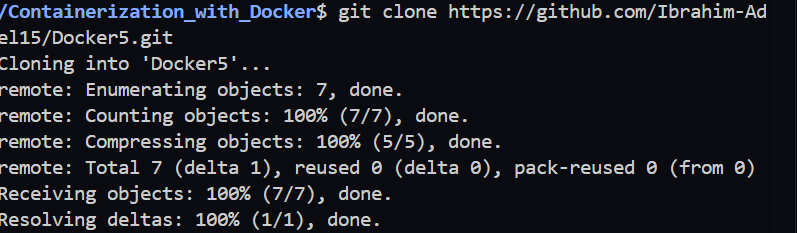

---

## Step 2: Create Frontend Dockerfile

Navigate to the frontend directory:

```bash
cd frontend
```

Create the following Dockerfile:

```dockerfile
FROM python:3.12

WORKDIR /app

COPY requirements.txt .

RUN pip install --no-cache-dir -r requirements.txt

COPY . .

EXPOSE 5000

CMD ["python","app.py"]
```

Build the image:

```bash
docker build -t frontend-image .
```

### Screenshot

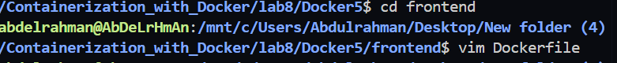
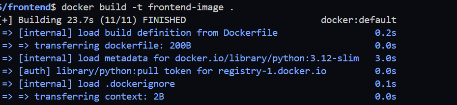

---

## Step 3: Create Backend Dockerfile

Navigate to the backend directory:

```bash
cd ../backend
```

Create the following Dockerfile:

```dockerfile
FROM python:3.12

WORKDIR /app

COPY . .

RUN pip install --no-cache-dir flask

COPY . .

EXPOSE 5000

CMD ["python","app.py"]
```

Build the image:

```bash
docker build -t backend-image .
```

### Screenshot

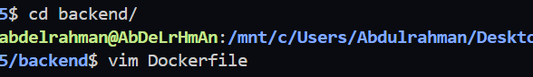
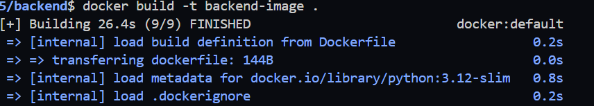

---

## Step 4: Verify Images

List Docker images:

```bash
docker images
```

### Screenshot

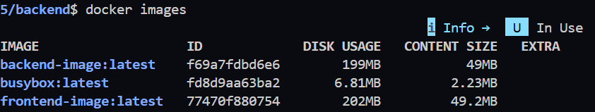

---

## Step 5: Create a Custom Network

Create a bridge network with the required subnet:

```bash
docker network create \
--driver bridge \
--subnet 192.168.10.0/24 \
ivolve-network
```

Verify the network:

```bash
docker network ls
```

Inspect the network:

```bash
docker network inspect ivolve-network
```

### Screenshot

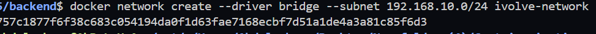
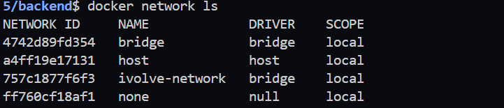

---

## Step 6: Run the Backend Container

```bash
docker run -d \
--name backend \
--network ivolve-network \
backend-image
```

### Screenshot


---

## Step 7: Run the Frontend Containers

Run the first frontend container using the custom network:

```bash
docker run -d \
--name frontend1 \
-p 5001:5000 \
--network ivolve-network \
frontend-image
```

Run the second frontend container using the default bridge network:

```bash
docker run -d \
--name frontend2 \
-p 5002:5000 \
frontend-image
```

Verify running containers:

```bash
docker ps
```

### Screenshot

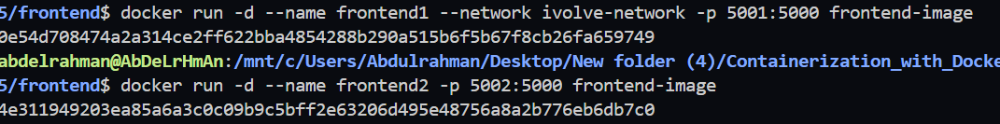
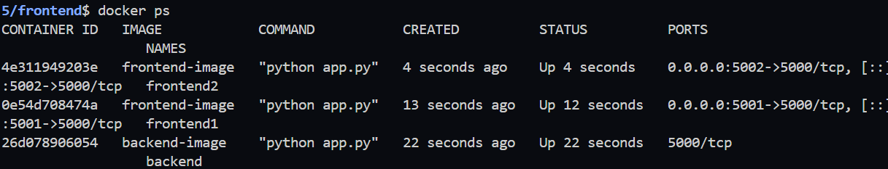

---

## Step 8: Verify Container Communication

Inspect the custom network:

```bash
docker network inspect ivolve-network
```

Verify that **backend** and **frontend1** are connected to the custom network.

### Screenshot


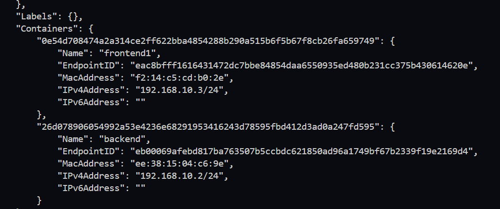

---

## Step 9: Test Communication

Enter the first frontend container:

```bash
docker exec -it frontend1 bash
```

Verify communication with the backend:

```bash
ping backend
```


Exit the container:

```bash
exit
```

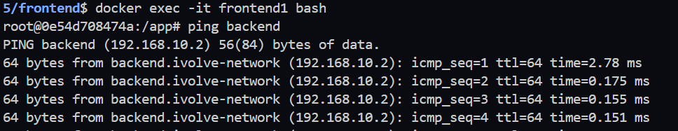


Enter the second frontend container:

```bash
docker exec -it frontend2 bash
```

Try the same command:

```bash
ping backend
```


The communication should fail because **frontend2** is connected to the default bridge network.

### Screenshot

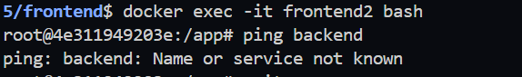

---

## Step 10: Remove Containers

Stop the containers:

```bash
docker stop backend frontend1 frontend2
```

Remove the containers:

```bash
docker rm backend frontend1 frontend2
```

## Step 11: Delete the Custom Network

Delete the network:

```bash
docker network rm ivolve-network
```

Verify deletion:

```bash
docker network ls
```

### Screenshot

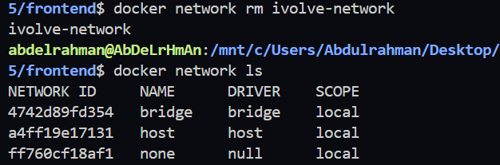

---

# Result

In this lab, we successfully:

* Built Docker images for the frontend and backend applications.
* Created a custom Docker bridge network.
* Connected multiple containers to the custom network.
* Verified communication between containers on the same network.
* Verified that containers on different networks cannot communicate using container names.
* Removed all containers and deleted the custom Docker network successfully.

---

## Technologies Used

* Docker
* Docker Networks
* Python
* Flask
* Git
* Bridge Networking
* Microservices
