# Lab 9: Containerized Node.js and MySQL Stack Using Docker Compose

## Objective

This lab demonstrates how to containerize a Node.js application with a MySQL database using Docker Compose. It also verifies the application health endpoints, access logs, persistent storage, and publishes the Docker image to Docker Hub.

---

## Prerequisites

- Docker Compose
- Git
- Docker Hub account

---

# Step 1: Clone the Repository

Clone the application source code:

```bash
git clone https://github.com/Ibrahim-Adel15/kubernets-app.git

cd kubernets-app
```

### Screenshot

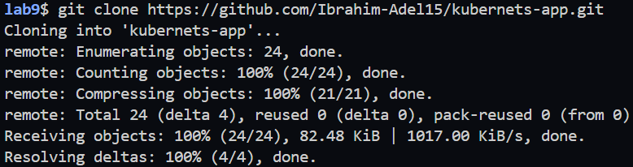

---

# Step 2: discover Dockerfile


### Screenshot

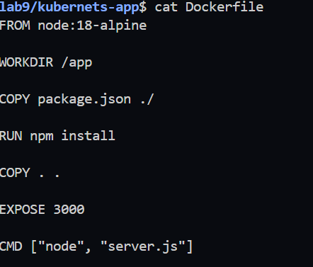

---

# Step 3: Create docker-compose.yml

```yaml
services:

  app:
    build: .
    container_name: node-app

    ports:
      - "3000:3000"

    environment:
      DB_HOST: db
      DB_USER: ivolve
      DB_PASSWORD: ivolve123
      DB_NAME: ivolve

    depends_on:
      - db

  db:
    image: mysql:8.0

    container_name: mysql-db

    restart: always

    environment:
      MYSQL_ROOT_PASSWORD: root123
      MYSQL_DATABASE: ivolve
      MYSQL_USER: ivolve
      MYSQL_PASSWORD: ivolve123

    volumes:
      - db_data:/var/lib/mysql

volumes:
  db_data:
```

### Screenshot

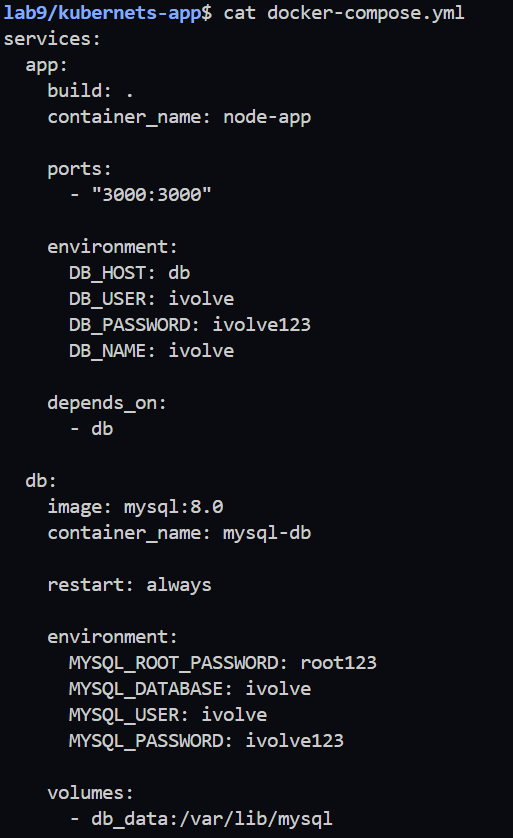

---

# Step 4: Build and Start the Containers

Build:

```bash
docker compose build
```

Run:

```bash
docker compose up -d
```

Verify:

```bash
docker ps
```

### Screenshot

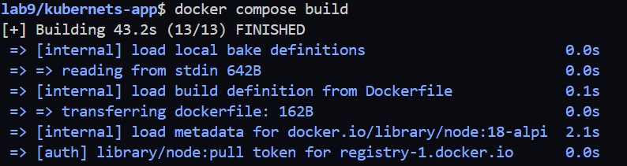

---

# Step 5: Connect to MySQL

Enter the MySQL container.

```bash
docker exec -it mysql-db bash
```

Login using the created user.

```bash
mysql -u ivolve -p
```

Password

```text
ivolve123
```

Show databases.

```sql
SHOW DATABASES;
```


### Screenshot

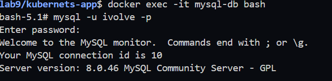
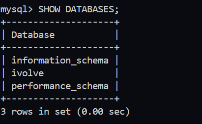

---

# Step 6: Verify the Application

Open the browser.

```
http://localhost:3000
```

or

```bash
curl http://localhost:3000
```


# Step 7: Verify Health Endpoint

```bash
curl http://localhost:3000/health
```

### Screenshot

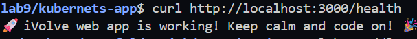

---

# Step 8: Verify Ready Endpoint

```bash
curl http://localhost:3000/ready
```

### Screenshot

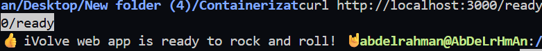

---

# Step 9: Verify Access Logs

Enter the application container.

```bash
docker exec -it node-app sh
```

Go to the logs directory.

```bash
cd /app/logs
```

Display the logs.

```bash
cat access.log
```

### Screenshot

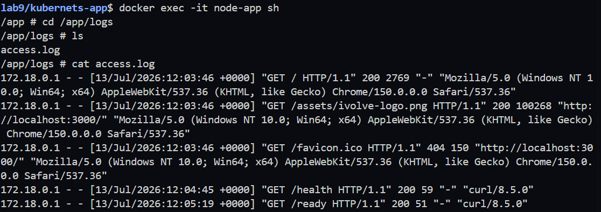

---

# Step 10: Verify Docker Volume

```bash
docker volume ls
```

Inspect the volume.

```bash
docker volume inspect db_data
```

### Screenshot

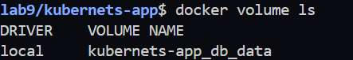

---

# Step 11: Verify Docker Network

```bash
docker network ls
```

Inspect the compose network.

```bash
docker network inspect kubernets-app_default
```

### Screenshot


---

# Step 12: Push Image to Docker Hub

View images.

```bash
docker images
```

Tag the image.

```bash
docker tag kubernets-app-app:latest abdelrahman20o2/kubernets-app-app:latest
```

Login.

```bash
docker login
```

Push.

```bash
docker push abdelrahman20o2/kubernets-app-app:latest
```

### Screenshot

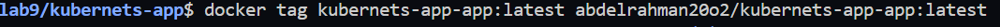
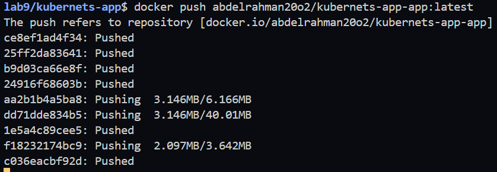

---

# Step 13: Verify Docker Hub Repository

Open Docker Hub and verify the uploaded image.

### Screenshot

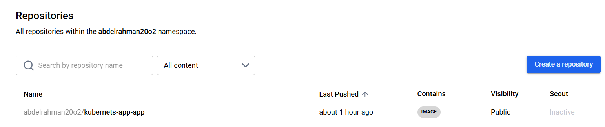

---

# Result

In this lab, we successfully:

- Containerized a Node.js application.
- Deployed a MySQL database using Docker Compose.
- Created a dedicated database and user.
- Used Docker Volumes for persistent database storage.
- Verified the application and health endpoints.
- Verified application access logs.
- Uploaded the application image to Docker Hub successfully.

---

# Technologies Used

- Docker
- Docker Compose
- Node.js
- MySQL 8
- Docker Hub
- Git