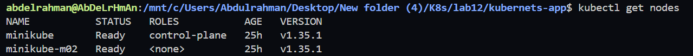
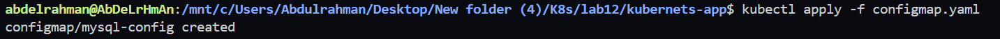
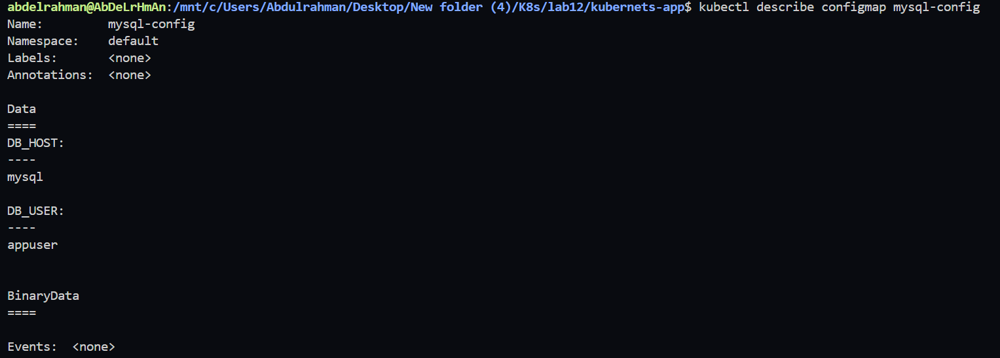
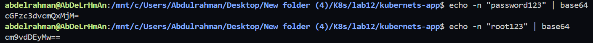
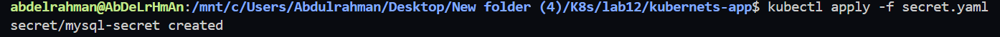
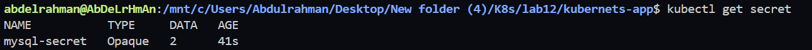
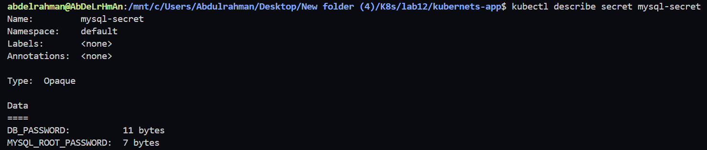
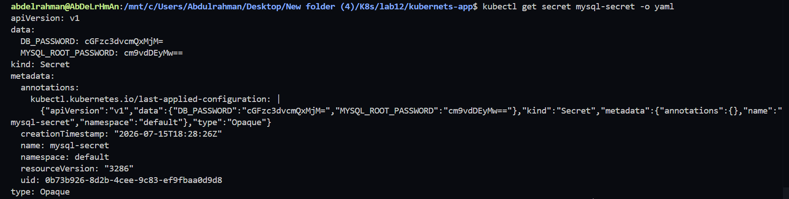

# Lab 12: Managing Configuration and Sensitive Data with ConfigMaps and Secrets

## Objective

In this lab, we will:

* Create a **ConfigMap** to store non-sensitive MySQL configuration.
* Create a **Secret** to store sensitive MySQL credentials.
* Encode Secret values using **Base64**.
* Apply and verify both resources in Kubernetes.

---

# Step 1: Verify the Kubernetes Cluster

Check that your Kubernetes cluster is running.

```bash
kubectl get nodes
```

**Expected Output**

```
NAME        STATUS   ROLES           AGE   VERSION
minikube    Ready    control-plane   ...
```



---

# Step 2: Create the ConfigMap

Create a file named **configmap.yaml**.

```yaml
apiVersion: v1
kind: ConfigMap
metadata:
  name: mysql-config
data:
  DB_HOST: mysql
  DB_USER: appuser
```

Apply the ConfigMap.

```bash
kubectl apply -f configmap.yaml
```

Verify it.

```bash
kubectl get configmap
```

Describe it.

```bash
kubectl describe configmap mysql-config
```





---

# Step 3: Encode Secret Values Using Base64

Encode the database password.

```bash
echo -n "password123" | base64
```

Example Output

```
cGFzc3dvcmQxMjM=
```

Encode the MySQL root password.

```bash
echo -n "root123" | base64
```

Example Output

```
cm9vdDEyMw==
```



---

# Step 4: Create the Secret

Create a file named **secret.yaml**.

```yaml
apiVersion: v1
kind: Secret
metadata:
  name: mysql-secret
type: Opaque
data:
  DB_PASSWORD: cGFzc3dvcmQxMjM=
  MYSQL_ROOT_PASSWORD: cm9vdDEyMw==
```

Apply the Secret.

```bash
kubectl apply -f secret.yaml
```



---

# Step 5: Verify the Secret

List all secrets.

```bash
kubectl get secret
```

Describe the secret.

```bash
kubectl describe secret mysql-secret
```

Display the Secret in YAML format.

```bash
kubectl get secret mysql-secret -o yaml
```








---

# Step 6: Decode the Secret (Verification)

Decode the database password.

```bash
echo cGFzc3dvcmQxMjM= | base64 --decode
```

Output

```
password123
```

Decode the MySQL root password.

```bash
echo cm9vdDEyMw== | base64 --decode
```

Output

```
root123
```


---

# Files Created

```
Lab12/
├── configmap.yaml
└── secret.yaml
```

---

# Lab Summary

In this lab, we successfully:

* Created a Kubernetes ConfigMap for non-sensitive configuration.
* Created a Kubernetes Secret for sensitive credentials.
* Encoded Secret values using Base64.
* Applied the resources to the Kubernetes cluster.
* Verified the ConfigMap and Secret.
* Decoded the Secret values to validate the stored credentials.

---

# Commands Used

```bash
kubectl get nodes

kubectl apply -f configmap.yaml
kubectl get configmap
kubectl describe configmap mysql-config

echo -n "password123" | base64
echo -n "root123" | base64

kubectl apply -f secret.yaml
kubectl get secret
kubectl describe secret mysql-secret
kubectl get secret mysql-secret -o yaml

echo cGFzc3dvcmQxMjM= | base64 --decode
echo cm9vdDEyMw== | base64 --decode
```
