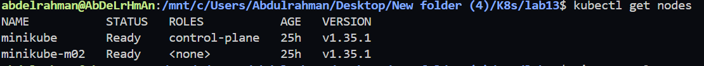
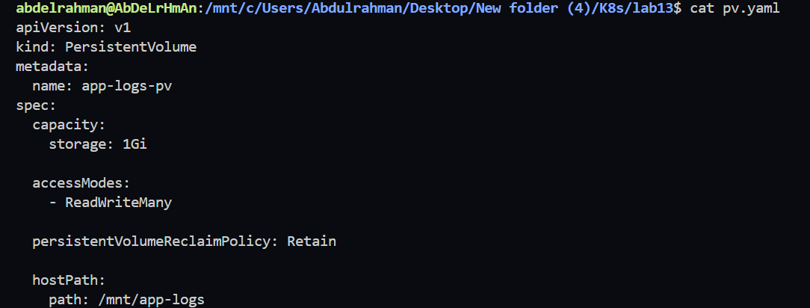
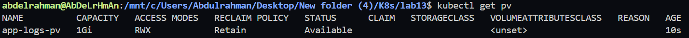
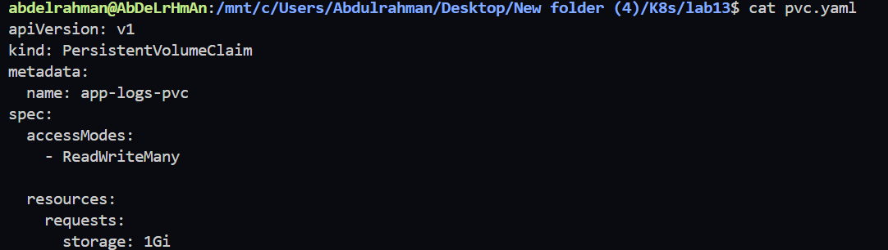
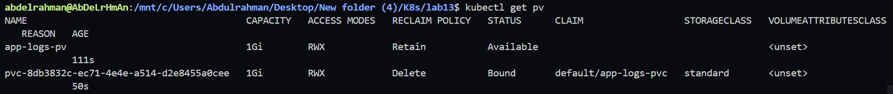
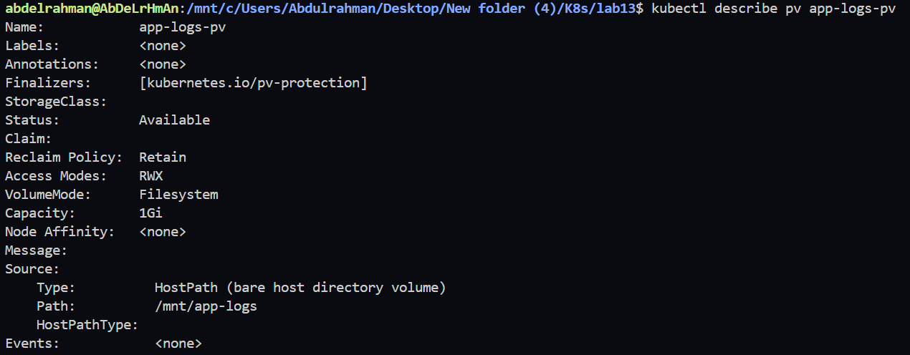
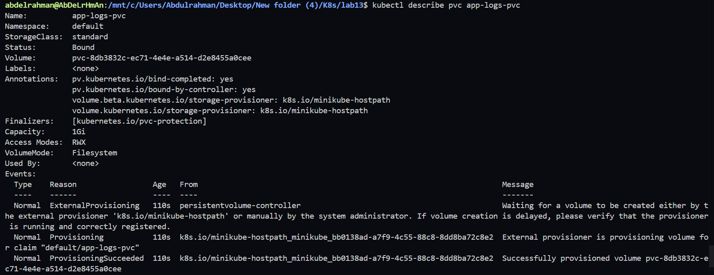

# Lab 13: Persistent Storage Setup for Application Logging

## Objective

In this lab, we will:

* Create a Persistent Volume (PV) with 1Gi storage.
* Use hostPath storage type.
* Configure ReadWriteMany access mode.
* Set the reclaim policy to Retain.
* Create a Persistent Volume Claim (PVC).
* Bind the PVC to the PV successfully.

---

# Step 1: Verify the Kubernetes Cluster

```bash
kubectl get nodes
```



---

# Step 2: Create the Persistent Volume

Create a file named `pv.yaml`.

```yaml
apiVersion: v1
kind: PersistentVolume
metadata:
  name: app-logs-pv
spec:
  capacity:
    storage: 1Gi

  accessModes:
    - ReadWriteMany

  persistentVolumeReclaimPolicy: Retain

  hostPath:
    path: /mnt/app-logs
```

Apply the PV:

```bash
kubectl apply -f pv.yaml
```

Verify:

```bash
kubectl get pv
```






---

# Step 3: Create the Persistent Volume Claim

Create a file named `pvc.yaml`.

```yaml
apiVersion: v1
kind: PersistentVolumeClaim
metadata:
  name: app-logs-pvc
spec:
  accessModes:
    - ReadWriteMany

  resources:
    requests:
      storage: 1Gi
```

Apply the PVC:

```bash
kubectl apply -f pvc.yaml
```

Verify:

```bash
kubectl get pvc
```




---

# Step 4: Verify Volume Binding

Check Persistent Volumes:

```bash
kubectl get pv
```

Check Persistent Volume Claims:

```bash
kubectl get pvc
```

Display PV details:

```bash
kubectl describe pv app-logs-pv
```

Display PVC details:

```bash
kubectl describe pvc app-logs-pvc
```








---

# Files Created

```text
Lab13/
├── pv.yaml
└── pvc.yaml
```

---

# Lab Summary

Successfully completed:

* Created a Persistent Volume with 1Gi capacity.
* Configured hostPath storage.
* Enabled ReadWriteMany access mode.
* Set reclaim policy to Retain.
* Created a matching Persistent Volume Claim.
* Verified successful binding between PV and PVC.

---

# Commands Used

```bash
kubectl get nodes

kubectl apply -f pv.yaml
kubectl get pv

kubectl apply -f pvc.yaml
kubectl get pvc

kubectl describe pv app-logs-pv
kubectl describe pvc app-logs-pvc
```
