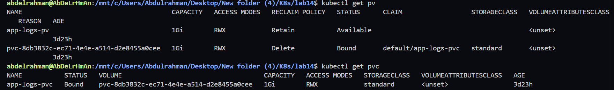
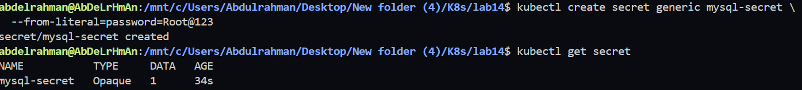
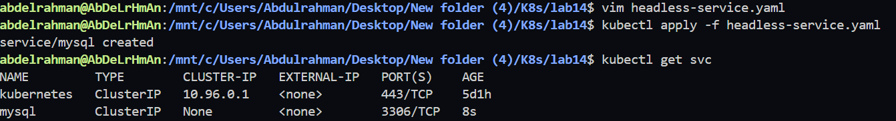
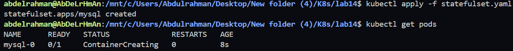
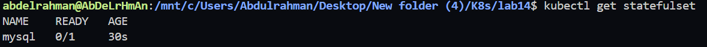
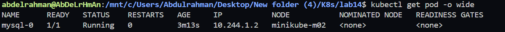
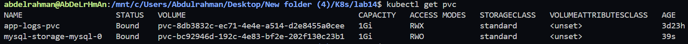
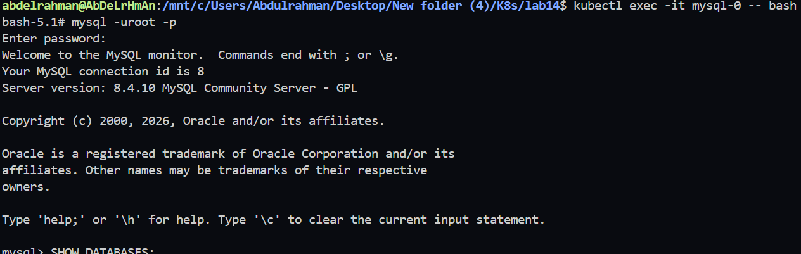
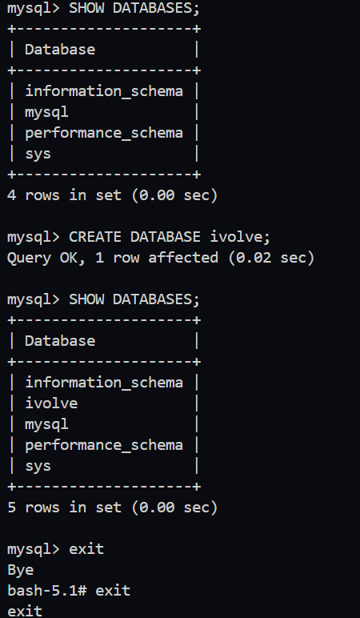

# Lab 14: StatefulSet with Headless Service

## Objective

In this lab, we will:

* Create a MySQL StatefulSet with one replica.
* Store the MySQL root password in a Kubernetes Secret.
* Configure a Persistent Volume Claim for persistent storage.
* Mount the storage to `/var/lib/mysql`.
* Add a toleration to allow scheduling on a tainted node.
* Create a Headless Service for stable network identity.
* Verify that MySQL is running successfully.

---

# Step 1: Verify Persistent Volume and Persistent Volume Claim

Check that the Persistent Volume and Persistent Volume Claim are available.

```bash
kubectl get pv
kubectl get pvc
```

**Screenshot**



---

# Step 2: Create MySQL Secret

Create a Secret to store the MySQL root password.

```bash
kubectl create secret generic mysql-secret \
--from-literal=password=Root@123
```

Verify the Secret.

```bash
kubectl get secret
```

**Screenshot**



---

# Step 3: Create Headless Service

Create a file named **headless-service.yaml**

```yaml
apiVersion: v1
kind: Service
metadata:
  name: mysql
spec:
  clusterIP: None
  selector:
    app: mysql
  ports:
    - port: 3306
      targetPort: 3306
```

Apply the manifest.

```bash
kubectl apply -f headless-service.yaml
```

Verify the Service.

```bash
kubectl get svc
```

Expected output:

```text
NAME    TYPE        CLUSTER-IP   PORT(S)
mysql   ClusterIP   None         3306/TCP
```

**Screenshot**



---

# Step 4: Create StatefulSet

Create a file named **statefulset.yaml**

```yaml
apiVersion: apps/v1
kind: StatefulSet
metadata:
  name: mysql
spec:
  serviceName: mysql
  replicas: 1

  selector:
    matchLabels:
      app: mysql

  template:
    metadata:
      labels:
        app: mysql

    spec:
      tolerations:
      - key: "node"
        operator: "Equal"
        value: "worker"
        effect: "NoSchedule"

      containers:
      - name: mysql
        image: mysql:8

        ports:
        - containerPort: 3306

        env:
        - name: MYSQL_ROOT_PASSWORD
          valueFrom:
            secretKeyRef:
              name: mysql-secret
              key: password

        volumeMounts:
        - name: mysql-storage
          mountPath: /var/lib/mysql

      volumes:
      - name: mysql-storage
        persistentVolumeClaim:
          claimName: mysql-pvc
```

Apply the StatefulSet.

```bash
kubectl apply -f statefulset.yaml
```

**Screenshot**



---

# Step 5: Verify StatefulSet

Check the StatefulSet.

```bash
kubectl get statefulset
```

Describe the StatefulSet.

```bash
kubectl describe statefulset mysql
```

**Screenshot**



---

# Step 6: Verify Pod

Check that the Pod is running.

```bash
kubectl get pods -o wide
```

Expected output:

```text
NAME      READY   STATUS    NODE
mysql-0   1/1     Running   minikube-m02
```

**Screenshot**



---

# Step 7: Verify PVC

Verify that the Persistent Volume Claim is bound.

```bash
kubectl get pvc
```

**Screenshot**



---

# Step 8: Connect to MySQL

Open a shell inside the Pod.

```bash
kubectl exec -it mysql-0 -- bash
```

If `bash` is unavailable:

```bash
kubectl exec -it mysql-0 -- sh
```

Connect to MySQL.

```bash
mysql -uroot -p
```

Enter the password:

```text
Root@123
```

Expected prompt:

```text
mysql>
```

**Screenshot**



---

# Step 9: Verify Database

List all databases.

```sql
SHOW DATABASES;
```

Create a new database.

```sql
CREATE DATABASE ivolve;
```

Verify it.

```sql
SHOW DATABASES;
```

Exit MySQL.

```sql
exit
```

Exit the container.

```bash
exit
```

**Screenshot**



---

# Step 10: Verify Headless Service DNS

Display Pod information.

```bash
kubectl get pods -o wide
```

Expected Pod name:

```text
mysql-0
```

The stable DNS name provided by the Headless Service is:

```text
mysql-0.mysql.default.svc.cluster.local
```

This DNS name remains stable even if the Pod is recreated, which is one of the main advantages of using a StatefulSet with a Headless Service.


# Lab Summary

In this lab, we successfully:

* Created a MySQL StatefulSet.
* Used a Kubernetes Secret for the MySQL root password.
* Mounted persistent storage using a Persistent Volume Claim.
* Configured a Pod toleration for a tainted node.
* Created a Headless Service for stable networking.
* Verified that MySQL was running and accessible.
* Confirmed persistent storage and StatefulSet functionality.
