# Lab 15: Node.js Application Deployment with ClusterIP Service

## Objective

Deploy a Node.js application on Kubernetes using a Deployment with two replicas, configure environment variables using ConfigMap and Secret, mount a Persistent Volume, add a Toleration for scheduling, and expose the application using a ClusterIP Service.

---

# Prerequisites

* Kubernetes Cluster (Minikube with 2 Nodes)
* Docker Hub Image
* Existing MySQL StatefulSet
* Persistent Volume (PV)
* Persistent Volume Claim (PVC)

---

# Step 1: Verify Cluster Status

```bash
kubectl get nodes
```

**Screenshot**

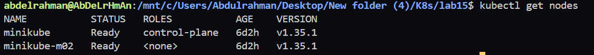


---

# Step 2: Verify Persistent Storage

```bash
kubectl get pv
kubectl get pvc
```

Expected Output

* PV Status: Available/Bound
* PVC Status: Bound

**Screenshot**

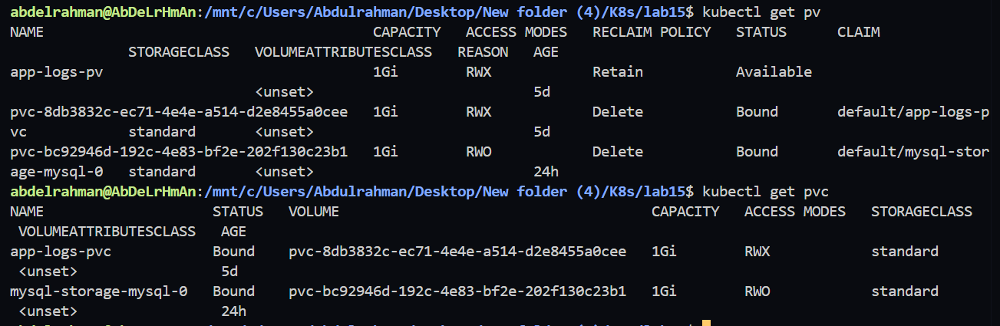


---

# Step 3: Create ConfigMap

Create **configmap.yaml**

```yaml
apiVersion: v1
kind: ConfigMap
metadata:
  name: nodejs-config
data:
  APP_NAME: "NodeJS App"
  PORT: "3000"
```

Apply

```bash
kubectl apply -f configmap.yaml
```

Verify

```bash
kubectl get configmap
```

**Screenshot**

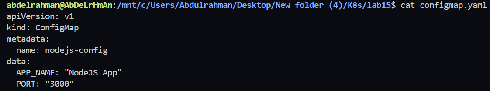


---

# Step 4: Create Secret

Create Secret

```bash
kubectl create secret generic nodejs-secret \
--from-literal=DB_USER=myuser \
--from-literal=DB_PASSWORD=mypassword
```

Verify

```bash
kubectl get secret
```

**Screenshot**

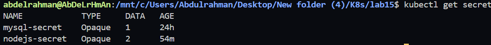


---

# Step 5: Create Deployment

Create **deployment.yaml**

Features included:

* 2 Replicas
* Custom Docker Image
* ConfigMap
* Secret
* Persistent Volume
* Toleration
* MySQL Connection

Apply

```bash
kubectl apply -f deployment.yaml
```

Verify Deployment

```bash
kubectl get deployment
```

Verify Pods

```bash
kubectl get pods -o wide
```

**Screenshot**

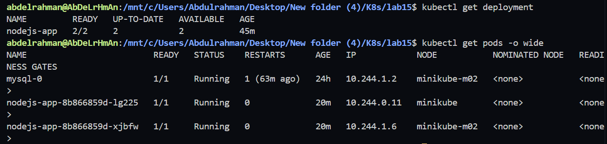


---

# Step 6: Verify Toleration

```bash
kubectl describe pod <pod-name> | grep -A 3 "Tolerations"
```

Expected Output

```text
Tolerations:
node=worker:NoSchedule
```

**Screenshot**

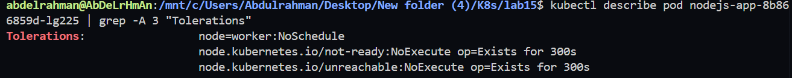


---

# Step 7: Create ClusterIP Service

Create **service.yaml**

```yaml
apiVersion: v1
kind: Service
metadata:
  name: nodejs-service
spec:
  selector:
    app: nodejs
  ports:
  - port: 80
    targetPort: 3000
  type: ClusterIP
```

Apply

```bash
kubectl apply -f service.yaml
```

Verify

```bash
kubectl get svc
```

**Screenshot**

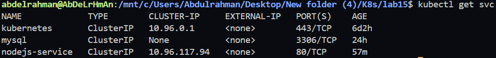


---

# Step 8: Verify Endpoints

```bash
kubectl get endpoints nodejs-service
```

Expected Output

```text
10.xxx.xxx.xxx:3000
10.xxx.xxx.xxx:3000
```

**Screenshot**

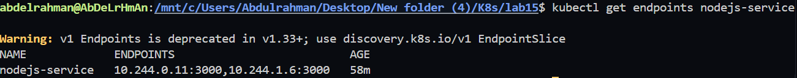


---

# Step 9: Create MySQL User

Connect to MySQL

```bash
kubectl exec -it mysql-0 -- mysql -uroot -p
```

Create User

```sql
CREATE USER 'myuser'@'%' IDENTIFIED BY 'mypassword';

GRANT ALL PRIVILEGES ON ivolve.* TO 'myuser'@'%';

FLUSH PRIVILEGES;
```

Verify

```sql
SELECT user, host FROM mysql.user;
```

**Screenshot**

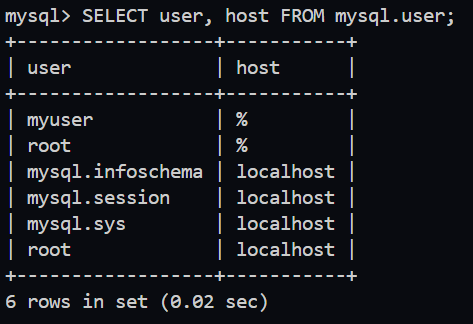


---

# Step 10: Restart Deployment

```bash
kubectl rollout restart deployment nodejs-app
```

Wait until rollout completes

```bash
kubectl rollout status deployment/nodejs-app
```

---

# Step 11: Verify Application Logs

```bash
kubectl logs -f deployment/nodejs-app
```

Expected Output

```text
Connected to MySQL and 'ivolve' DB found.
Server started on http://0.0.0.0:3000
```

**Screenshot**

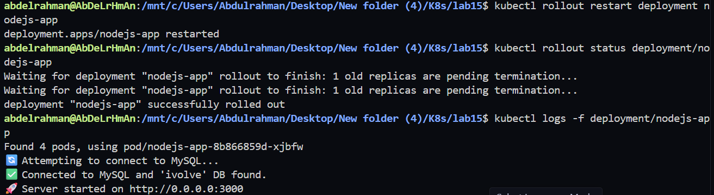


---

# Step 12: Test the Service

Create a temporary BusyBox Pod

```bash
kubectl run test --image=busybox -it --rm -- sh
```

Inside BusyBox

```bash
wget -qO- http://nodejs-service
```

Expected Result

The application page should be returned successfully.

**Screenshot**

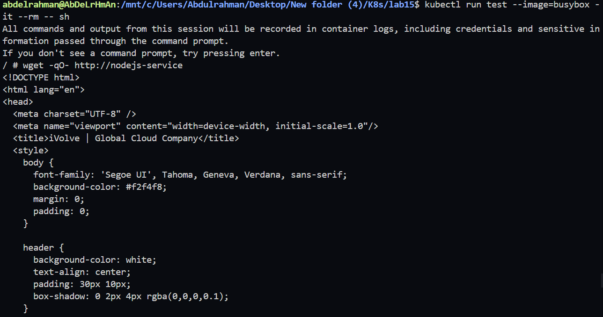


---

# Project Structure

```
lab15
│
├── configmap.yaml
├── deployment.yaml
├── service.yaml
└── README.md
```

---

# Technologies Used

* Kubernetes
* Docker
* Node.js
* MySQL
* ConfigMap
* Secret
* Persistent Volume
* Persistent Volume Claim
* Deployment
* ClusterIP Service
* Tolerations

---

# Learning Outcomes

* Deploy a Node.js application using Kubernetes Deployment.
* Configure applications using ConfigMaps and Secrets.
* Mount Persistent Volumes into Pods.
* Use Tolerations to schedule Pods on tainted nodes.
* Expose applications internally using a ClusterIP Service.
* Connect a Kubernetes application to a MySQL StatefulSet.
* Troubleshoot Deployment, Service, PVC, and MySQL connectivity issues.
