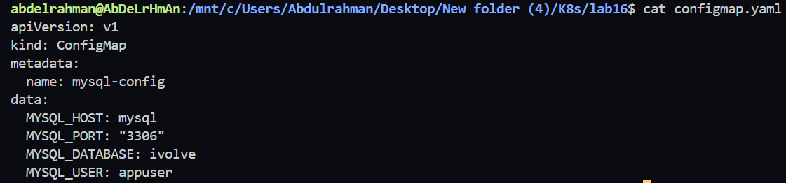
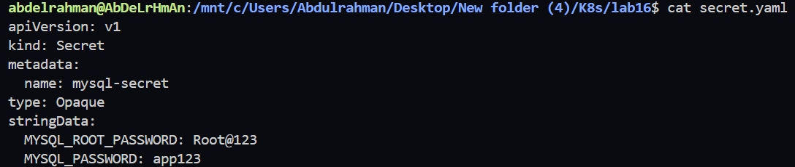
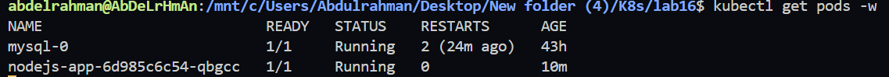
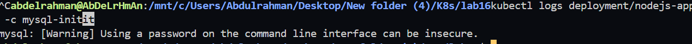
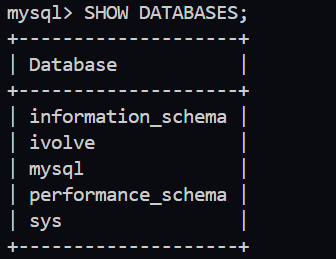
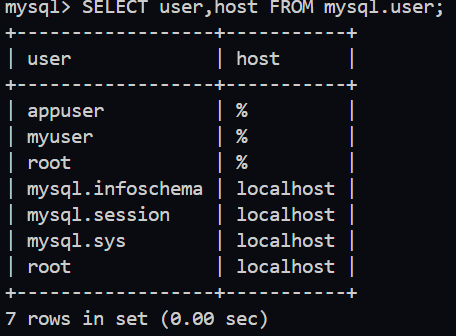
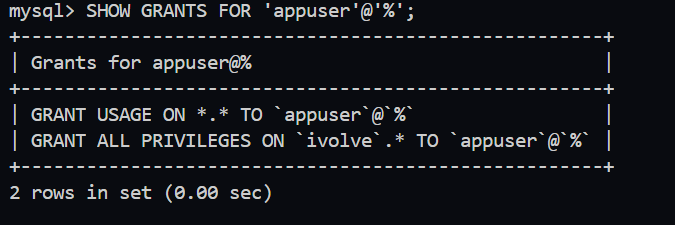

# Lab 16: Kubernetes Init Container for Pre-Deployment Database Setup

## Objective

In this lab, we modify the existing Node.js Deployment to use an **Init Container** that prepares the MySQL database before the application starts.

The Init Container will:

- Connect to the MySQL server.
- Create the `ivolve` database if it does not exist.
- Create the application user.
- Grant the user all privileges on the `ivolve` database.
- Exit successfully before the Node.js application starts.

---

# Architecture

```
             +--------------------+
             |    Init Container  |
             |    mysql:5.7       |
             +---------+----------+
                       |
                       |
               Create Database
               Create User
               Grant Privileges
                       |
                       v
               +---------------+
               |    MySQL      |
               +---------------+
                       |
                       |
             Init Completed ✔
                       |
                       v
             +----------------+
             | Node.js App    |
             +----------------+
```

---

# Prerequisites

- Kubernetes Cluster
- MySQL StatefulSet
- MySQL Service
- Node.js Application
- ConfigMap
- Secret

---

# Project Structure

```
lab16/
│
├── configmap.yaml
├── secret.yaml
├── deployment.yaml
└── README.md
```

---

# Step 1 - Create ConfigMap

Create a ConfigMap containing the database connection information.

```bash
kubectl apply -f configmap.yaml
```

### Verify

```bash
kubectl get configmap
```

### Screenshot




---

# Step 2 - Create Secret

Create a Secret containing:

- MySQL Root Password
- Application Password

```bash
kubectl apply -f secret.yaml
```

### Verify

```bash
kubectl get secret
```

### Screenshot




---

# Step 3 - Modify Deployment

Update the Deployment to include an Init Container.

The Init Container uses:

- Image: `mysql:5.7`
- ConfigMap Environment Variables
- Secret Environment Variables

It executes SQL commands to:

- Create Database
- Create User
- Grant Privileges
- Flush Privileges

After completion, the main Node.js container starts automatically.

---

# Step 4 - Deploy

```bash
kubectl apply -f deployment.yaml
```

Verify Deployment

```bash
kubectl get deployments
```

---

# Step 5 - Monitor Pod

```bash
kubectl get pods -w
```

Expected Output

```text
mysql-0                       Running

nodejs-app-xxxxxxxxx          Running
```

### Screenshot




---

# Step 6 - Verify Init Container

Display Init Container logs.

```bash
kubectl logs deployment/nodejs-app -c mysql-init
```

Expected Output

```text
mysql: [Warning] Using a password on the command line interface can be insecure.
```

> This is only a warning and indicates that the Init Container executed successfully.

### Screenshot




---

# Step 7 - Connect to MySQL

```bash
kubectl exec -it mysql-0 -- mysql -uroot -p
```

Enter the root password.

---

# Step 8 - Verify Database

```sql
SHOW DATABASES;
```

Expected Output

```
ivolve
```

### Screenshot




---

# Step 9 - Verify User

```sql
SELECT user, host FROM mysql.user;
```

Expected Output

```
appuser
```

### Screenshot




---

# Step 10 - Verify Privileges

```sql
SHOW GRANTS FOR 'appuser'@'%';
```

Expected Output

```sql
GRANT ALL PRIVILEGES ON `ivolve`.*
TO 'appuser'@'%';
```

### Screenshot




---

# Verification Commands

```bash
kubectl get pods

kubectl logs deployment/nodejs-app -c mysql-init

kubectl exec -it mysql-0 -- mysql -uroot -p
```

Inside MySQL

```sql
SHOW DATABASES;

SELECT user, host FROM mysql.user;

SHOW GRANTS FOR 'appuser'@'%';
```

---

# Files Used

- configmap.yaml
- secret.yaml
- deployment.yaml

---

# Lab Outcome

Successfully configured an Init Container to automate database initialization before the Node.js application starts.

The Init Container:

- Connected to MySQL.
- Created the `ivolve` database.
- Created the application user.
- Granted database privileges.
- Completed successfully before the application container started.

---

# Technologies Used

- Kubernetes
- Init Containers
- ConfigMap
- Secret
- MySQL
- Node.js
- StatefulSet