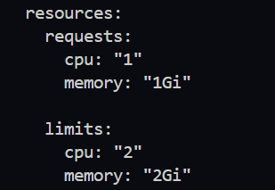
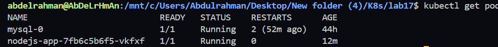
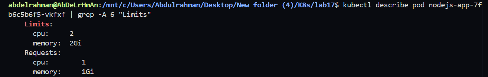
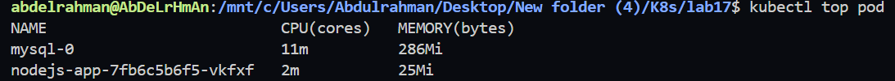

# Lab 17: Pod Resource Management with CPU and Memory Requests and Limits

## Objective

In this lab, we configure **CPU and Memory Requests & Limits** for the existing Node.js application Deployment.

Resource Requests guarantee the minimum resources required by the container, while Resource Limits prevent the container from consuming more than the specified resources.

---

# Resource Configuration

## Resource Requests

| Resource | Value |
|----------|-------|
| CPU | 1 vCPU |
| Memory | 1Gi |

## Resource Limits

| Resource | Value |
|----------|-------|
| CPU | 2 vCPUs |
| Memory | 2Gi |

---

# Architecture

```
+----------------------------+
|       Kubernetes Node      |
|                            |
|  +----------------------+  |
|  |     Node.js Pod      |  |
|  |                      |  |
|  | Requests             |  |
|  |   CPU    : 1         |  |
|  |   Memory : 1Gi       |  |
|  |                      |  |
|  | Limits               |  |
|  |   CPU    : 2         |  |
|  |   Memory : 2Gi       |  |
|  +----------------------+  |
|                            |
+----------------------------+
```

---

# Prerequisites

- Kubernetes Cluster
- Node.js Deployment
- Metrics Server (for `kubectl top`)

---

# Project Structure

```
lab17/
│
├── deployment.yaml
└── README.md
```

---

# Step 1 - Update Deployment

Modify the existing Deployment and add the following resources section.

```yaml
resources:
  requests:
    cpu: "1"
    memory: "1Gi"

  limits:
    cpu: "2"
    memory: "2Gi"
```

---

# Step 2 - Apply Changes

Apply the updated Deployment.

```bash
kubectl apply -f deployment.yaml
```

Verify the rollout.

```bash
kubectl rollout status deployment/nodejs-app
```

### Screenshot




---

# Step 3 - Verify Running Pods

Check that the Deployment is running successfully.

```bash
kubectl get pods
```

Expected Output

```text
mysql-0                      Running

nodejs-app-xxxxxxxx          Running
```

### Screenshot




---

# Step 4 - Verify Resource Requests and Limits

Describe the Pod.

```bash
kubectl describe pod <pod-name>
```

Or display only the resource section.

```bash
kubectl describe pod <pod-name> | grep -A 6 "Limits"
```

Expected Output

```text
Limits:
  cpu:     2
  memory:  2Gi

Requests:
  cpu:     1
  memory:  1Gi
```

### Screenshot




---

# Step 5 - Monitor Resource Usage

Display real-time CPU and Memory usage.

```bash
kubectl top pod
```

Expected Output

```text
NAME                         CPU(cores)   MEMORY(bytes)

nodejs-app-xxxxxxxx          2m           34Mi

mysql-0                      7m           118Mi
```

### Screenshot




---

# If Metrics Server Is Missing

If the following error appears:

```text
error: Metrics API not available
```

Enable the Metrics Server in Minikube.

```bash
minikube addons enable metrics-server
```

Wait a minute, then verify again.

```bash
kubectl top pod
```

---

# Verification Commands

Check Pod status.

```bash
kubectl get pods
```

Verify Requests & Limits.

```bash
kubectl describe pod <pod-name>
```

Or

```bash
kubectl describe pod <pod-name> | grep -A 6 "Limits"
```

Monitor resource usage.

```bash
kubectl top pod
```

---

# Files Used

- deployment.yaml

---

# Lab Outcome

Successfully configured CPU and Memory Requests & Limits for the Node.js Deployment.

Verified:

- Resource Requests
- Resource Limits
- Running Pod
- Real-time CPU usage
- Real-time Memory usage

using:

- `kubectl describe pod`
- `kubectl top pod`

---

# Technologies Used

- Kubernetes
- Deployment
- Resource Requests
- Resource Limits
- CPU Management
- Memory Management
- Metrics Server
