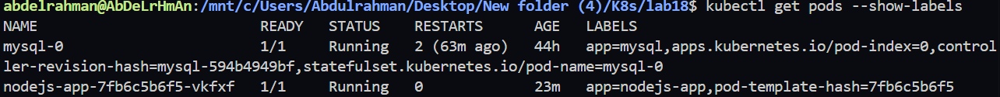
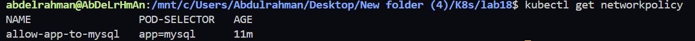
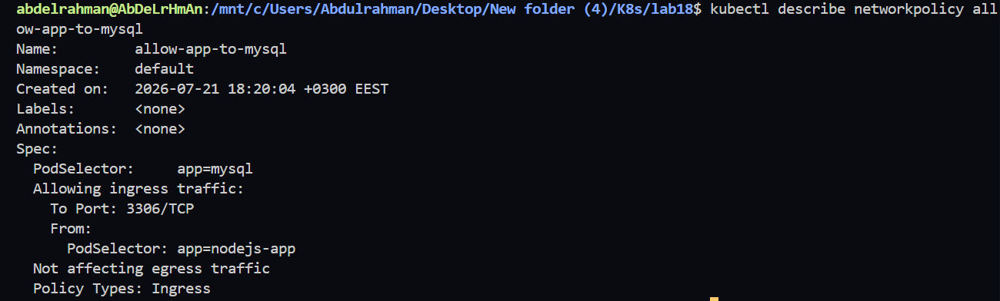
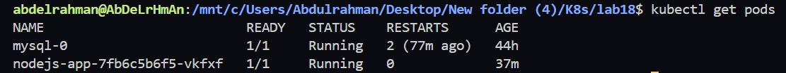
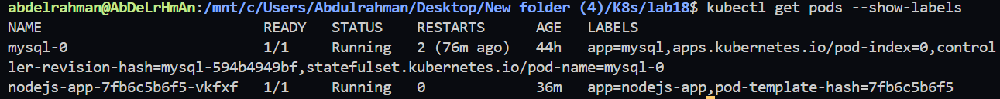

# Lab 18: Control Pod-to-Pod Traffic via Network Policy

## Objective

In this lab, we configure a **Kubernetes NetworkPolicy** to secure communication between application pods and the MySQL database.

The NetworkPolicy allows **only the Node.js application pods** to access the MySQL database on **TCP port 3306**, while denying ingress traffic from all other pods.

---

# Architecture

```
                     +----------------------+
                     |   Node.js Pods       |
                     | app=nodejs-app       |
                     +----------+-----------+
                                |
                                | TCP 3306
                                |
                                ▼
                     +----------------------+
                     |      MySQL Pod       |
                     |      app=mysql       |
                     +----------------------+

        Any Other Pod
              │
              └───────────────X──────────────► MySQL
                     Access Denied
```

---

# Prerequisites

- Kubernetes Cluster
- MySQL StatefulSet
- Node.js Deployment
- Kubernetes NetworkPolicy Support

---

# Project Structure

```
lab18/
│
├── networkpolicy.yaml
└── README.md
```

---

# Step 1 - Verify Pod Labels

Check the labels applied to the application and database pods.

```bash
kubectl get pods --show-labels
```

Expected Labels

| Pod | Label |
|------|-------|
| MySQL | `app=mysql` |
| Node.js | `app=nodejs-app` |

### Screenshot




---

# Step 2 - Create the NetworkPolicy

Create the following NetworkPolicy.

```yaml
apiVersion: networking.k8s.io/v1
kind: NetworkPolicy

metadata:
  name: allow-app-to-mysql

spec:
  podSelector:
    matchLabels:
      app: mysql

  policyTypes:
  - Ingress

  ingress:
  - from:
    - podSelector:
        matchLabels:
          app: nodejs-app

    ports:
    - protocol: TCP
      port: 3306
```

---

# Step 3 - Apply the NetworkPolicy

```bash
kubectl apply -f networkpolicy.yaml
```

Verify that the policy was created.

```bash
kubectl get networkpolicy
```

Expected Output

```text
NAME

allow-app-to-mysql
```

### Screenshot




---

# Step 4 - Verify the NetworkPolicy

Display the NetworkPolicy details.

```bash
kubectl describe networkpolicy allow-app-to-mysql
```

Expected Output

```text
PodSelector: app=mysql

Policy Types:
  Ingress

From:
  PodSelector: app=nodejs-app

Port:
  TCP 3306
```

### Screenshot




---

# Step 5 - Verify Running Pods

```bash
kubectl get pods
```

Expected Output

```text
mysql-0

nodejs-app-xxxxxxxx
```

### Screenshot




---

# Step 6 - Verify Pod Labels

```bash
kubectl get pods --show-labels
```

Example Output

```text
mysql-0
app=mysql

nodejs-app-xxxxxxxx
app=nodejs-app
```

### Screenshot




---

# Verification Commands

Display all Network Policies.

```bash
kubectl get networkpolicy
```

Describe the NetworkPolicy.

```bash
kubectl describe networkpolicy allow-app-to-mysql
```

Display Pod labels.

```bash
kubectl get pods --show-labels
```

---

# Files Used

- networkpolicy.yaml

---

# Lab Outcome

Successfully created a Kubernetes **NetworkPolicy** that:

- Targets MySQL pods using the `app=mysql` label.
- Applies **Ingress** rules only.
- Allows incoming traffic only from Node.js application pods (`app=nodejs-app`).
- Restricts access to the MySQL default port (**3306/TCP**).

The NetworkPolicy was successfully created and verified using:

- `kubectl get networkpolicy`
- `kubectl describe networkpolicy`
- `kubectl get pods --show-labels`

> **Note:** This lab was performed on a Kubernetes cluster using the **kindnet** CNI plugin. While the NetworkPolicy resource is created successfully, **kindnet does not enforce NetworkPolicy rules**. To validate traffic blocking behavior, use a CNI plugin that supports NetworkPolicy enforcement, such as **Calico** or **Cilium**.

---

# Technologies Used

- Kubernetes
- NetworkPolicy
- Pod Labels
- MySQL
- Node.js
- StatefulSet
- Deployment
- Cluster Networking